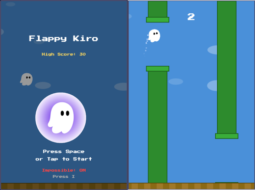
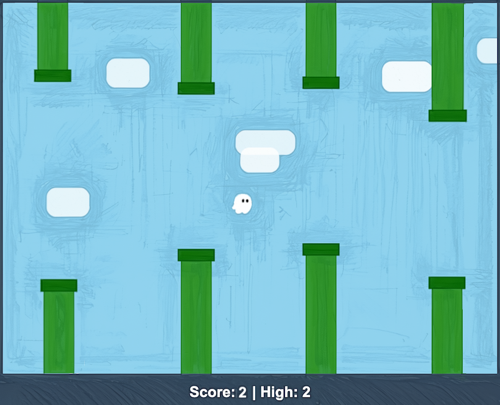

# What is a Workshop?
*An event that provides space for knowledge to blossom into experience*

We learn by doing. Through this doing, we gain experience, which in turn (typically) improves our doing.  Workshops are prime opportunities to gain experience with a particular technology. However, "workshop" can mean different things to different people. Nothing inherently wrong with that; however for the purposes of this guide, we'll need to be clear on the definition being used.

Workshops are a time and place to gather together. They take what we know in our heads and provide an opportunity to really "know" something...experientially. Can they be done individually or virtually? Absolutely; however these approaches reduce scheduling and transportation issues.  If those are not constraints, the reduction of benefits might not be worth it. Ultimately, some experience is better than no experience, so do what is best for our situation.  This guide focuses on in-person workshops specifically for AWS User Groups, but can be adapted to virtual or individual ones.

> "There is no compression algorithm for experience." - Andy Jassy, CEO, Amazon Web Services (2021)

Workshops are hands-on and active. In other words, it's not a spectator sport. Watching might be a necessary part of completing the workshop, but it should not be the primary activity. The "doing" is taking book knowledge and turning it into action, and then experience.  This cannot be done by just watching.

Workshops should have an objective. That objective might be to wander and explore, but it's better to be working towards an objective. Most people aren't looking to gain experience so that they can wander better. When sharing their experience (e.g. during an interview), people will want to talk about what they did. Having an objective aligns that conversation.  Building something (e.g. a game, a working application) is frequently the best option, but gaining experience with a process (e.g. generating a CloudFormation template from existing resources) is also good.

A great example of a workshop guides participants to build this game:

starting with just this image:

Before we move on to defining objectives, let's take a quick detour on naming.  "Workshop" is the term used throughout this guide.  We are defining it to be clear because "workshop" can be used by others to mean something else.  Likewise another term like "lab", "bootcamp", "hands-on tutorial", "immersion day", "codelab", "seminar", "builder session", "deep dive" or "training" could refer to what we define here as a "workshop". Don't get hung up on the name, just be clear about what you're looking for or providing. That clarity starts with having clear objectives.

---

[Home](../README.md) | [Next: Learning Objectives ▶](../02-LearningObjectives/LearningObjectives.md)
